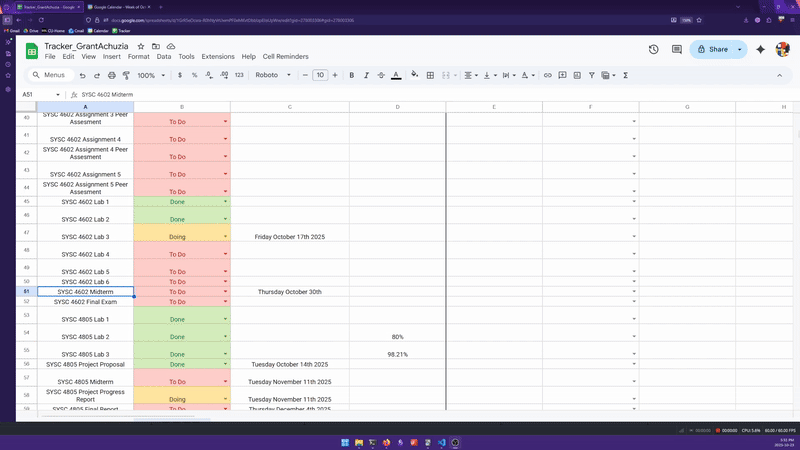

# Cell Reminders 

Google Sheets add-on/script that creates Google Calendar events linked to specific sheet cells

## Developer Quick Start

**Want to use this immediately while waiting for Google Marketplace availability?**

Follow the [Developer Guide](scripts/GUIDE.md#) for the Cell Reminders Script

## Features

- **Repeat Options**: Daily, weekly, monthly, or yearly recurring tasks
- **Universal Sheet Support**: Works with any Google Sheet you have access to
- **Cross-Platform**: Reminders sync across all Google services and devices

## Contributing

Check out the [contributing.md](contributing.md) if you'd like to help out with the project

## Privacy Policy

Checkout [privacy-policy.md](privacy-policy.md) or Cell Reminder's [freeprivacypolicy.com](https://www.freeprivacypolicy.com/live/a55ddcb7-0163-4e4b-9031-ed9b7066e9bc) page for information on how user data is handled
